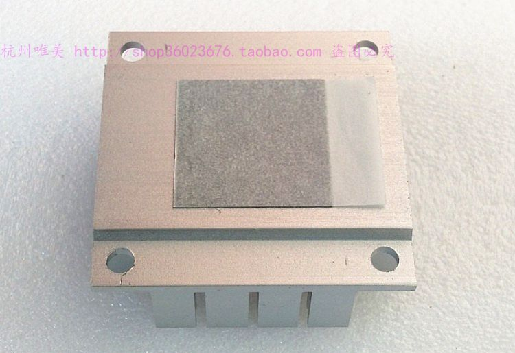

* 479风扇背板 散热器底板 M3螺纹 41mm孔距 散热
* [AMD INTEL 散热器 AVC NMB 台达 SUNON NIDEC等风扇 散热片](https://sixintadi.taobao.com/ "AMD INTEL 散热器 AVC NMB 台达 SUNON NIDEC等风扇 散热片")
* 掌柜：[2008飞机驾驶员](https://sixintadi.taobao.com/ "掌柜:2008飞机驾驶员")

* 品牌: Delta/台达
* 型号: 其他/other
* 适用对象: Intel平台
* 散热器类型: 风扇
* 成色: 全新
* 颜色分类: 单独背板一个无其它 单散热片无其它 背板加散热片送螺丝

颜色分类
* 单独背板一个无其它 2.50
* 单散热片无其它 2.50
* 背板加散热片送螺丝 5.00

全新 全新 全新 全新 

4.1CM孔距479平台散热器 

原配台达5CM-5010风扇 拆掉了 现出售背板和散热片

不配风扇的 自己配风扇请选择5CM 5010风扇（边到边5CM厚1CM 尺寸不对安装不了）

金属背板孔位4.1CM孔距 螺丝为规格M3 

散热片材质：铝

散热片尺寸（长宽高）：50×50×18MM 

相邻螺丝孔心距：41X41（正方形孔位）MM

背板实物图：

背板实物图：

5010风扇安装效果图（自备5010风扇）：

* offline images

