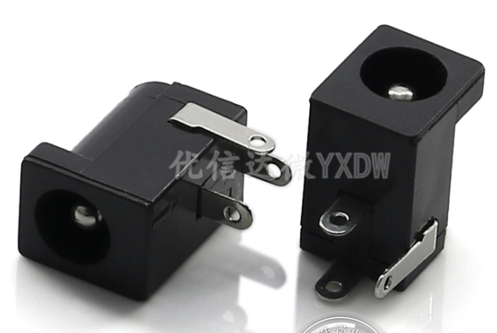
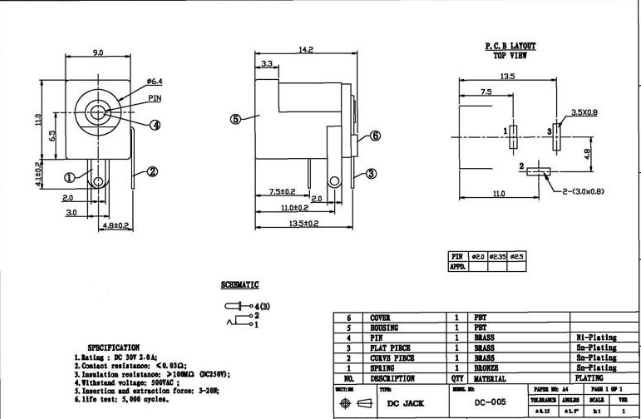
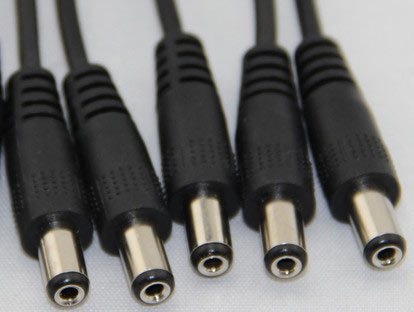
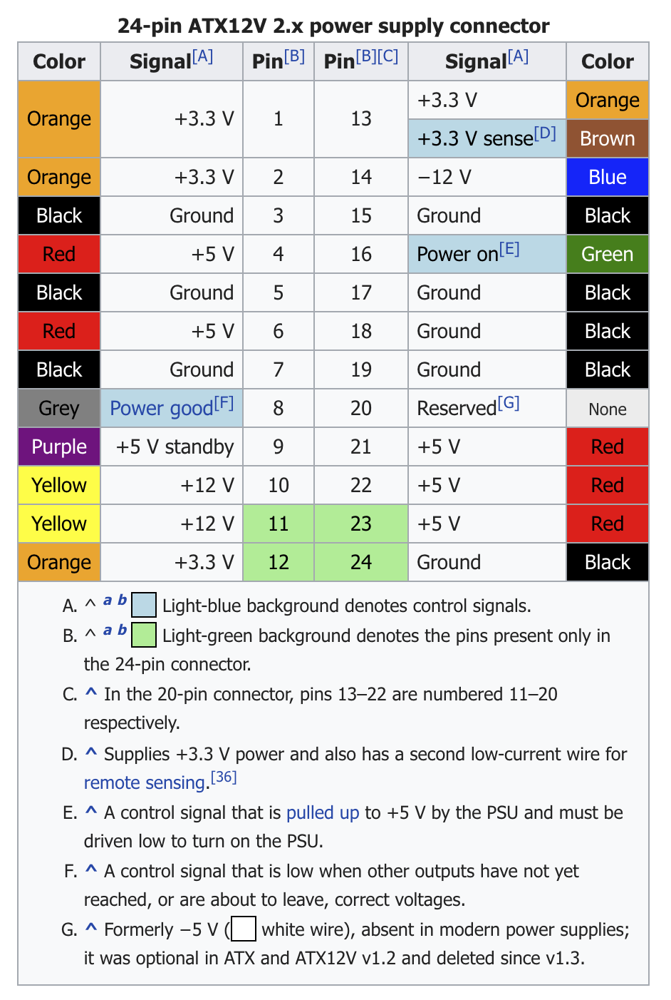
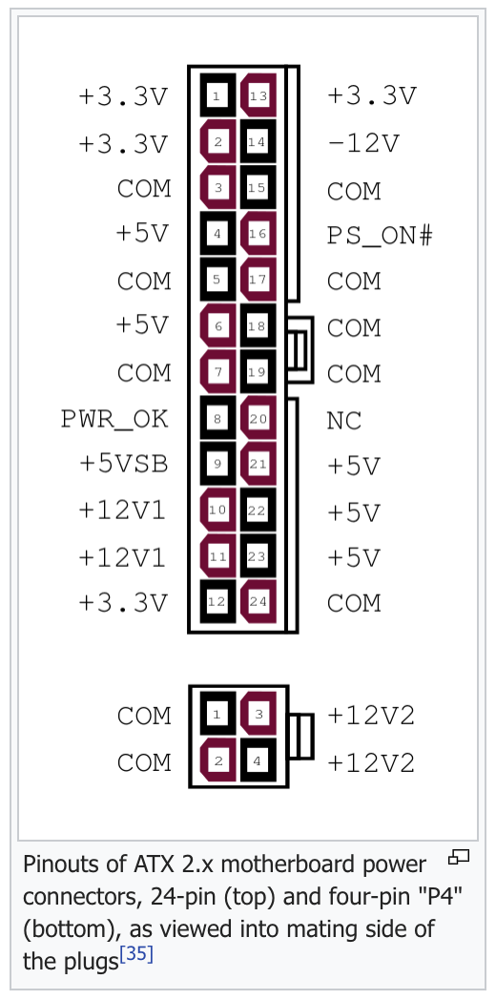
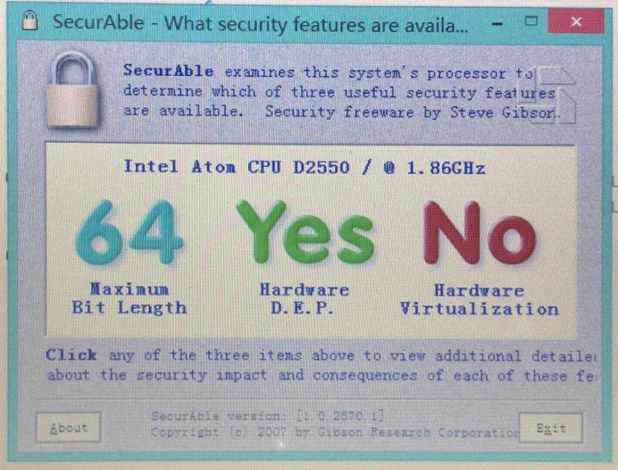
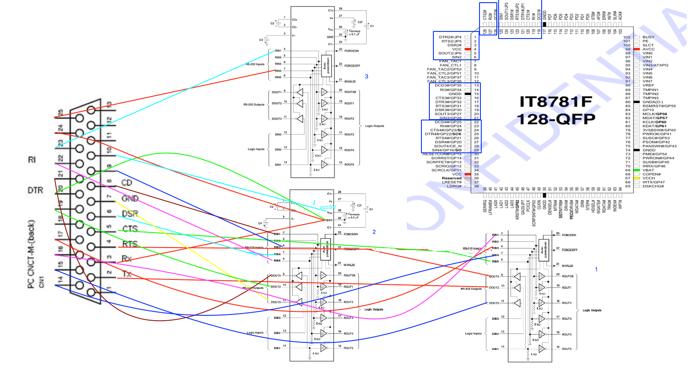

# Intel Atom D2550 Motherboard

## Hardware PCBA review
### CPU - [D2550 Intel SPEC]( https://ark.intel.com/products/65470/Intel-Atom-Processor-D2550-1M-Cache-1-86-GHz-)
|Feature|Spec|Note|
|----|----|----|
|Product Collection|Intel® Atom™ Processor D Series|
Code Name|Cedarview
Launch Date|Q1'12
Cores|2
Threads|4
Processor Base Frequency|1.86 GHz
TDP|10W
Max Memory Size|4GB
Memory Types|DDR3 800/1066
Max # of Memory Channels|1
Max # of PCI Express Lanes|4
Turbo Boost|No
Hyper-Threading|Yes
Virtualization (VT-x)|No
Virtualization for Directed I/O (VT-d)|No
Intel 64|Yes
### HeatSink and Fan
* Active or passive heatsink
* 12v fan
### Memory DIMM
* DIMM Type: DDR3 
* Freqency: 1333/1066/800 MHz
* Module size: 1/2/4 GB
### Storage connection
* Standard SATA port
* Mini-PCIE SATA port
* SATA power connector
* 
### Network
* RTL8111E 
### Power supply
* DC 12v 5.5mm x 2.5mm Coaxial power connector
    * SPEC [Coaxial Power connector](https://en.wikipedia.org/wiki/Coaxial_power_connector)
    * Male: Receptacle/Jack/Socket/DC插头座 5.5x2.5mm
    
    
    * Female: Plug 
    
* ATX 20 x PIN 
    * SPEC: [20/24-pin ATX12V 2.x power supply connector + CPU P4 ](https://en.wikipedia.org/wiki/Power_supply_unit_(computer)#Wiring_diagrams)
    
    
* ATX 12v 2 x 4
### Peripherals 
* IT87 [IT8786E-I Datasheet](ds_it87_rs232/IT8786E.pdf)
* Serial/RS232 [MF243/MAX3243E](ds_it87_rs232/RS232_max3243e.pdf)
* LPT port
* USB 2.0
* USB 3.0

## Tools
[tools](tools)
* AFU DOS v3.07.01
    * [AFU DOS HELP CN](AFUDOS_CN.md)
* BITS v2079
* Phoenixtool v273
* Rufus 3.1p
* Securable

## Hack BIOS to enable 64-bit x86_64 OS support
### BIOS
### Check MSR config
* Refer post

### IDA reverse engineering 
### Phonix packaging 
### Program/Flash BIOS
* Flashrom version
```
~ brew info flashrom
flashrom: stable 1.0 (bottled), HEAD
Identify, read, write, verify, and erase flash chips
https://flashrom.org/
/usr/local/Cellar/flashrom/1.0 (6 files, 470.1KB) *
  Poured from bottle on 2018-07-17 at 21:10:38
From: https://github.com/Homebrew/homebrew-core/blob/master/Formula/flashrom.rb
==> Dependencies
Build: pkg-config ✔
Required: libftdi0 ✔, libusb-compat ✔
==> Options
--HEAD
	Install HEAD version
==> Analytics
install: 105 (30 days), 263 (90 days), 871 (365 days)
install_on_request: 106 (30 days), 263 (90 days), 815 (365 days)
build_error: 0 (30 days)
```
* Flashrom help
```
~ flashrom -h
flashrom v1.0 on Darwin 18.2.0 (x86_64)
flashrom is free software, get the source code at https://flashrom.org

Please note that the command line interface for flashrom has changed between
0.9.5 and 0.9.6 and will change again before flashrom 1.0.

Usage: flashrom [-h|-R|-L|-p <programmername>[:<parameters>] [-c <chipname>]
[-E|(-r|-w|-v) <file>] [(-l <layoutfile>|--ifd) [-i <imagename>]...] [-n] [-N] [-f]]
[-V[V[V]]] [-o <logfile>]

 -h | --help                        print this help text
 -R | --version                     print version (release)
 -r | --read <file>                 read flash and save to <file>
 -w | --write <file>                write <file> to flash
 -v | --verify <file>               verify flash against <file>
 -E | --erase                       erase flash memory
 -V | --verbose                     more verbose output
 -c | --chip <chipname>             probe only for specified flash chip
 -f | --force                       force specific operations (see man page)
 -n | --noverify                    don't auto-verify
 -N | --noverify-all                verify included regions only (cf. -i)
 -l | --layout <layoutfile>         read ROM layout from <layoutfile>
      --ifd                         read layout from an Intel Firmware Descriptor
 -i | --image <name>                only flash image <name> from flash layout
 -o | --output <logfile>            log output to <logfile>
 -L | --list-supported              print supported devices
 -p | --programmer <name>[:<param>] specify the programmer device. One of
    dummy, ft2232_spi, serprog, buspirate_spi, dediprog, pony_spi,
    usbblaster_spi, pickit2_spi, ch341a_spi.

You can specify one of -h, -R, -L, -E, -r, -w, -v or no operation.
If no operation is specified, flashrom will only probe for flash chips.
```
* Flashrom to write BIOS binary into SPI flash
```
➜  time flashrom -p serprog:dev=/dev/tty.usbserial-A100NEXI:115200 -w 7175_t1.ROM -c "MX25L1605A/MX25L1606E/MX25L1608E"
flashrom v1.0 on Darwin 17.6.0 (x86_64)
flashrom is free software, get the source code at https://flashrom.org

Calibrating delay loop... OK.
serprog: Programmer name is "frser-duino"
Found Macronix flash chip "MX25L1605A/MX25L1606E/MX25L1608E" (2048 kB, SPI) on serprog.
Reading old flash chip contents... done.
Erasing and writing flash chip... Erase/write done.
Verifying flash... VERIFIED.
flashrom -p serprog:dev=/dev/tty.usbserial-A100NEXI:115200 -w 7175_t1.ROM -c   4.54s user 1.77s system 1% cpu 6:39.01 total
```
## OS
### Grub black screen issue
### Linux black screen issue
```
Need root
$ sudo su - root
# change /etc/default/grub
GRUB_CMDLINE_LINUX_DEFAULT="gma500_gfx.blacklist=yes"
# update-grub

# echo "blacklist gma500_gfx" >> /etc/modprobe.d/blacklist-gma500_gfx.conf
# update-initramfs -u
# reboot
```
### OpenWRT x86_64 installation 
### Synology DSM

## TE7075M
* PCBA: TE7075M
* [Vendor public datasheet - TopStar-M7075-SPEC](TopStar-M7075-SPEC.md)
* [Heatsink small factor](Hestsink-small-factor-taobao.md)
### BIOS SPI flash
[SPI flash MX25L1606E](ds_it87_rs232/MX25L1606E.pdf)
### IT87 TTL map to RS232

```
GND 3/20/24
VCC5V 10

MAX3243E CHIP-1
DB25/PIN	MAX3243E-2	PIN	MAX3243E-2	PIN	IT8186E	PIN
	RS232		TTL
5	RIN5	8	ROUT5	15	RI1#	-10/-11
14	RIN4	7	ROUT4	16	SIN1	-4
17	RIN3	6	ROUT3	17	CTS1#	-9
NA	RIN2	5	ROUT2	18	DCD1#	-10/-11
16	RIN1	4	ROUT1	19	DSR1#	-6
4	DOUT1	9	DIN1	14	RTS1#	-7
2	DOUT2	10	DIN2	13	SOUT1	-5
15	DOUT3	11	DIN3	12	DTR1#	-8

MAX3243E CHIP-2
DB25/PIN	MAX3243E-2	PIN	MAX3243E-2	PIN	IT8186E	PIN
	RS232		TTL
22	RIN5	8	ROUT5	15	RI2#	14
6	RIN4	7	ROUT4	16	SIN2	20
9	RIN3	6	ROUT3	17	CTS2#	15
NA	RIN2	5	ROUT2	18	DCD2#	13
8	RIN1	4	ROUT1	19	DSR2#	18
21	DOUT1	9	DIN1	14	RTS2#	17
19	DOUT2	10	DIN2	13	SOUT2	19
7	DOUT3	11	DIN3	12	DTR2#	16


MAX3243E CHIP-3
DB25/PIN	MAX3243E-2	PIN	MAX3243E-2	PIN	IT8181/6E	PIN
	RS232		TTL
	RIN5	8	ROUT5	15	RIx#	
25	RIN4	7	ROUT4	16	SIN4	55/short with 54
	RIN3	6	ROUT3	17	CTSx#	
	RIN2	5	ROUT2	18	DCDx#	
23	RIN1	4	ROUT1	19	DSRx#	NA
	DOUT1	9	DIN1	14	RTSx#	
13	DOUT2	10	DIN2	13	SOUT4	54
	DOUT3	11	DIN3	12	DTRx#	
```
* test result with ubuntu 18.04 server
    * self test, connect Tx/Rx with one wire
    ```
    MAP to ttyS0 and ttyS1
    root@ubt1804x64:~# picocom -c -b 115200 /dev/ttyS0
    picocom v2.2

    port is        : /dev/ttyS0
    flowcontrol    : none
    baudrate is    : 115200
    parity is      : none
    databits are   : 8
    stopbits are   : 1
    escape is      : C-a
    local echo is  : yes
    noinit is      : no
    noreset is     : no
    nolock is      : no
    send_cmd is    : sz -vv
    receive_cmd is : rz -vv -E
    imap is        :
    omap is        :
    emap is        : crcrlf,delbs,

    Type [C-a] [C-h] to see available commands

    Terminal ready
    ABCDEFGHIJK
    ```
* System kernel mesg
    ```
    root@ubt1804x64:~# dmesg|grep tty
    [    0.000000] console [tty0] enabled
    [    2.267278] 00:07: ttyS0 at I/O 0x3f8 (irq = 4, base_baud = 115200) is a 16550A
    [    2.288581] 00:08: ttyS1 at I/O 0x2f8 (irq = 3, base_baud = 115200) is a 16550A
    [    2.309848] 00:09: ttyS2 at I/O 0x3e8 (irq = 7, base_baud = 115200) is a 16550A
    [    2.331125] 00:0a: ttyS3 at I/O 0x2e8 (irq = 7, base_baud = 115200) is a 16550A
    [    2.352379] 00:0b: ttyS4 at I/O 0x2f0 (irq = 7, base_baud = 115200) is a 16550A
    root@ubt1804x64:~# dmesg|grep 16550
    [    2.246171] Serial: 8250/16550 driver, 32 ports, IRQ sharing enabled
    [    2.267278] 00:07: ttyS0 at I/O 0x3f8 (irq = 4, base_baud = 115200) is a 16550A
    [    2.288581] 00:08: ttyS1 at I/O 0x2f8 (irq = 3, base_baud = 115200) is a 16550A
    [    2.309848] 00:09: ttyS2 at I/O 0x3e8 (irq = 7, base_baud = 115200) is a 16550A
    [    2.331125] 00:0a: ttyS3 at I/O 0x2e8 (irq = 7, base_baud = 115200) is a 16550A
    [    2.352379] 00:0b: ttyS4 at I/O 0x2f0 (irq = 7, base_baud = 115200) is a 16550A

    [    0.000000] Console: colour dummy device 80x25
    [    0.000000] console [tty0] enabled
    [    2.246171] Serial: 8250/16550 driver, 32 ports, IRQ sharing enabled
    [    2.267278] 00:07: ttyS0 at I/O 0x3f8 (irq = 4, base_baud = 115200) is a 16550A
    [    2.288581] 00:08: ttyS1 at I/O 0x2f8 (irq = 3, base_baud = 115200) is a 16550A
    [    2.309848] 00:09: ttyS2 at I/O 0x3e8 (irq = 7, base_baud = 115200) is a 16550A
    [    2.331125] 00:0a: ttyS3 at I/O 0x2e8 (irq = 7, base_baud = 115200) is a 16550A
    [    2.352379] 00:0b: ttyS4 at I/O 0x2f0 (irq = 7, base_baud = 115200) is a 16550A


    [    2.364746] ata_piix 0000:00:1f.2: version 2.13
    [    2.364980] ata_piix 0000:00:1f.2: MAP [ P0 P2 P1 P3 ]
    [    2.524903] scsi host0: ata_piix
    [    2.525408] scsi host1: ata_piix
    [    2.525676] ata1: SATA max UDMA/133 cmd 0xf0e0 ctl 0xf0d0 bmdma 0xf0a0 irq 19
    [    2.526017] ata2: SATA max UDMA/133 cmd 0xf0c0 ctl 0xf0b0 bmdma 0xf0a8 irq 19

    [    2.698279] ata1.00: supports DRM functions and may not be fully accessible
    [    2.698286] ata1.00: ATA-9: Samsung SSD 850 EVO 250GB, EMT01B6Q, max UDMA/133
    [    2.698289] ata1.00: 488397168 sectors, multi 1: LBA48 NCQ (depth 0/32)
    [    2.703663] ata1.00: supports DRM functions and may not be fully accessible
    [    2.705053] ata1.00: configured for UDMA/133
    [    2.705535] scsi 0:0:0:0: Direct-Access     ATA      Samsung SSD 850  1B6Q PQ: 0 ANSI: 5
    [    2.706415] sd 0:0:0:0: [sda] 488397168 512-byte logical blocks: (250 GB/233 GiB)
    [    2.706464] sd 0:0:0:0: [sda] Write Protect is off
    [    2.706469] sd 0:0:0:0: [sda] Mode Sense: 00 3a 00 00
    [    2.706552] sd 0:0:0:0: [sda] Write cache: enabled, read cache: enabled, doesn't support DPO or FUA
    [    2.706914] sd 0:0:0:0: Attached scsi generic sg0 type 0
    [    2.708068]  sda: sda1
    [    2.710595] sd 0:0:0:0: [sda] supports TCG Opal
    [    2.710600] sd 0:0:0:0: [sda] Attached SCSI disk


    [    4.376056] scsi host2: ahci
    [    4.377028] input: Dell Dell USB Keyboard as /devices/pci0000:00/0000:00:1d.0/usb2/2-1/2-1:1.0/0003:413C:2105.0001/input/input6
    [    4.411377] scsi host3: ahci
    [    4.429062] ata1: SATA max UDMA/133 abar m1024@0xdff04000 port 0xdff04100 irq 26
    [    4.436676] hid-generic 0003:413C:2105.0001: input,hidraw0: USB HID v1.10 Keyboard [Dell Dell USB Keyboard] on usb-0000:00:1d.0-1/input0
    [    4.465982] ata2: SATA max UDMA/133 abar m1024@0xdff04000 port 0xdff04180 irq 26
    [    4.484422] ata3: DUMMY
    [    4.503134] ata4: DUMMY
    [    4.834354] ata1: SATA link up 3.0 Gbps (SStatus 123 SControl 300)
    [    4.854064] ata1.00: supports DRM functions and may not be fully accessible
    [    4.872620] ata1.00: NCQ Send/Recv Log not supported
    [    4.890790] ata1.00: ATA-9: Samsung SSD 850 EVO 250GB, EMT01B6Q, max UDMA/133
    [    4.909086] ata1.00: 488397168 sectors, multi 1: LBA48 NCQ (depth 31/32), AA
    [    4.928680] ata1.00: supports DRM functions and may not be fully accessible
    [    4.947499] ata1.00: NCQ Send/Recv Log not supported
    [    4.966760] ata1.00: configured for UDMA/133
    [    4.985292] scsi 0:0:0:0: Direct-Access     ATA      Samsung SSD 850  1B6Q PQ: 0 ANSI: 5
    [    5.004462] sd 0:0:0:0: Attached scsi generic sg0 type 0
    [    5.004590] sd 0:0:0:0: [sda] 488397168 512-byte logical blocks: (250 GB/233 GiB)
    [    5.004636] sd 0:0:0:0: [sda] Write Protect is off
    [    5.004640] sd 0:0:0:0: [sda] Mode Sense: 00 3a 00 00
    [    5.004719] sd 0:0:0:0: [sda] Write cache: enabled, read cache: enabled, doesn't support DPO or FUA
    [    5.006095]  sda: sda1
    [    5.007524] sd 0:0:0:0: [sda] supports TCG Opal
    [    5.007530] sd 0:0:0:0: [sda] Attached SCSI disk
    [    5.446345] ata2: SATA link down (SStatus 0 SControl 300)

    ```

## M7072
* System Spec/Manual: [TBE-M7072](TopStar-M7072-SPEC.md)
* PCBA image
* BIOS: SD-M7072-J


