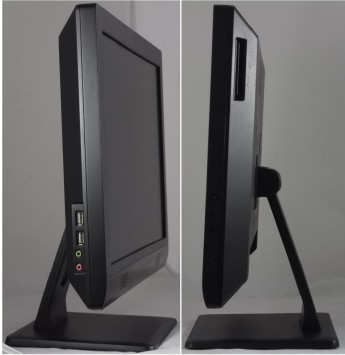

Below URL are obsolete now.

MB http://www.topstartech.cn/Product01.aspx?product_id=N0238&top_id=M00038&menu_id=M00040
TEB-M7075-1
http://www.topstartech.cn/Product01.aspx?product_id=N0213&top_id=M00038&menu_id=M00040
TEB-M7273

http://www.topstartech.cn/Product01.aspx?product_id=N0208&top_id=M00011&menu_id=M00011

TEA-S1603

http://www.topstartech.cn/cnweb/product01.aspx?product_id=N0208&top_id=M00011&menu_id=M00011

TEA-S1603

## TEA-S1603

### Overview
TEA-S1603是一款采用基于Intel Cedartrail平台一款的18.5寸一体机，内置定制板TEB-M7075，外形小巧美观，无风扇设计，具备良好的密封防尘、散热与抗震抗干扰性能，丰富的外设接口及功能扩展，可广泛应用于瘦客户机、银行、证券等行业应用中。
### Features:
* 基于Intel Cedartrail平台处理器的18.5寸一体机；
* VGA+LVDS的图形显示接口，支持独立双显模式；
* 6USB，4COM，2LAN，1Mini PCIe（wifi），1LPT；
* 1个2.5寸硬盘位，DC12V输入；
### Specifactions
* 尺寸规格 整机尺寸：18.5寸
* 处理器 Intel Cedarview-D 处理器
* 主芯片 Intel  NM10
* 内存 1*204pin DDR3 So-DIMM 1066/1333MHz 内存插槽 最大可扩展到4G 
* 显示接口 CPU内建图形核心 1*VGA，1*LVDS，支持独立双显模式
* 硬盘存储 1×2.5寸硬盘位
* 网络接口 2×LAN(100/1000M),支持网络唤醒功能
* I/O扩展 
    * 6×USB 2.0，4×COM
    * 1 ×Line-out，1 ×Mic-in，1×LPT
    * 2 ×LAN (100/1000M)
* 系统监测/看门狗 通过Supper I/O支持CPU、风扇等温度、状态的硬件监测功能；1~65535 Sec/Min，提供复位功能
* 扩展总线 1×Mini PCIe（wifi）；
* 环境 DC 12V 输入
* 工作温度：-10~450C
* 相对湿度：10%~90%，无冷凝
* 操作系统
    * WinXP/ WinXPE/ WIN7
    * Ordering information
* 产品型号 规格 TEA-S1603
* 18.5寸一体机，IntelCedartrail平台，支持1*VGA/1*LVDS/6×USB 2.0/4*COM/2 *LAN/1*Mini PCIe（wifi）/DC 12V输入